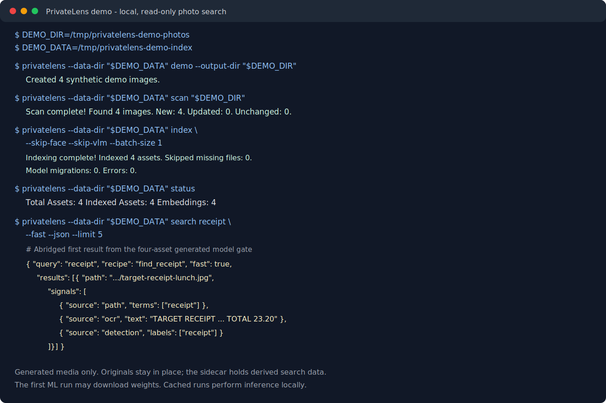

# PrivateLens

[](https://github.com/kenny2077/PrivateLens/actions/workflows/ci.yml)
[](https://www.python.org/)
[](LICENSE)
[](https://github.com/kenny2077/PrivateLens/stargazers)

**Local-first, read-only photo search sidecar with AI evidence cards.**

Find your photos by meaning, not by scrolling. PrivateLens indexes your existing photo folders without importing, moving, or managing them, then lets you search with natural language: "my driver license backup", "receipt from Target", "cat on the sofa". Results include evidence for why they matched.

> **Release status:** This branch is the PrivateLens `1.0.0` release candidate,
> not a published release. Local Apple Silicon gates include 181 tests, a
> 1,000-image reliability run, a 15-image local real-photo evaluation reported
> only in aggregate, and core/full CPU Docker builds. Hosted checks
> pass Python 3.11–3.13 and an isolated wheel consumer; the full CPU image also
> builds and passes HTTP health on Linux amd64 while running non-root with a
> read-only root filesystem. PyPI/GHCR publication and the full Compose/Ollama
> flow remain pending.
> CUDA and the desktop application are unsupported and are not shipped in 1.0.

## Core Principles

1. **Read-only originals** — PrivateLens never imports, moves, rewrites, or manages source photos.
2. **Local-first inference** — Search data and inference stay local unless you explicitly configure an integration or download a model.
3. **Multi-signal search** — Combine semantic CLIP vectors, OCR, faces, captions, and metadata.
4. **Explainable results** — Return the available evidence behind each match.
5. **CLI-first operation** — Human-readable output and JSON/NDJSON modes support both interactive and scripted use.

## Requirements and platform status

- Python 3.11, 3.12, or 3.13.
- `uv` for a source checkout, or `pip` for a published release.
- Ollama only if you enable optional VLM captioning or reranking.
- Free disk space for the SQLite sidecar, thumbnails, and model caches. Source
  photos remain in place.

| Environment | Status |
|-------------|--------|
| macOS on Apple Silicon | Primary development environment; verified locally with memory-conscious settings |
| CPU Docker image | Core and full images build locally on arm64; the hosted full image builds and passes HTTP health on Linux amd64 while running non-root with a read-only root filesystem |
| Full Docker Compose + Ollama | Preview; full-stack validation is still pending |
| Linux x86_64 | Hosted Python 3.11–3.13 and full CPU-container gates pass on Linux; bare-metal installation is not separately validated |
| Windows WSL2 | Not validated for 1.0 |
| Native Windows | Not currently a supported target |
| NVIDIA acceleration | Unsupported; 1.0 ships no CUDA image, Compose file, extra, or helper script |
| Desktop application | Unsupported; no desktop binary is shipped in 1.0 |

## Installation

### From a published release

Use this path after a PrivateLens release is available from your configured
Python package index:

```bash
python3 -m venv .venv
source .venv/bin/activate
# Linux CPU-only install: prevent PyPI's CUDA-enabled PyTorch build.
python -m pip install torch torchvision --index-url https://download.pytorch.org/whl/cpu
python -m pip install "privatelens[full]"
```

On macOS and Windows, omit the separate PyTorch command because their PyPI
wheels are already CPU-only. The Linux command uses PyTorch's official CPU
wheel index; PrivateLens 1.0 does not ship a supported CUDA runtime.

`privatelens[full]` installs the local CLIP, OCR, and face runtime used to build
a searchable index. `privatelens` without the extra is the lightweight CLI/API
core: it can scan folders, inspect an existing sidecar, and run non-ML search
modes, but it cannot run the normal CLIP/OCR indexing pass. Ollama and its VLM
weights remain separate. Read [THIRD_PARTY_MODELS.md](THIRD_PARTY_MODELS.md)
before enabling face or VLM features.

### From a source checkout

Run these commands from the repository root:

```bash
uv sync --python 3.11 --extra full
source .venv/bin/activate
```

For development tools as well, run `uv sync --all-extras`. These project
commands use the locked CPU-only PyTorch source on Linux. See
[CONTRIBUTING.md](CONTRIBUTING.md).

## Quick Start

```bash
# Print exact env, package, Ollama, model-cache, and verification commands
privatelens setup
privatelens setup --json

# See the Mac-safe first-run indexing workflow
privatelens quickstart

# Create a safe synthetic demo library
privatelens demo --output-dir /tmp/privatelens-demo-photos

# Optional: enable shell completion
privatelens completion zsh

# Scan a folder without moving photos
privatelens scan ~/Pictures
privatelens scan ~/Pictures --dry-run

# Index the core CLIP/OCR signals; face and VLM passes are opt-in
privatelens index --skip-face --skip-vlm --batch-size 1
privatelens index --dry-run

# Optional: keep the sidecar index current as files change
privatelens watch ~/Pictures

# Search with evidence and timing
privatelens search "driver license backup" --json
privatelens search "Target receipt" --json
privatelens search receipt --type path --json --limit 5
privatelens search --recipe find_receipt "Target"
privatelens search receipt --fast --json --limit 5
privatelens search receipt --open

# Inspect index status
privatelens status
privatelens status --json

# Preview and remove stale index records for photos that were moved/deleted
privatelens prune
privatelens prune --json --yes

# Privacy audit
privatelens doctor
privatelens doctor --json

# Face clustering
privatelens cluster --json

# Panic delete the index while keeping photos
privatelens purge
privatelens purge --json --yes
```

`privatelens watch` requires the full local ML pipeline because each debounced
change batch runs the canonical scan and index workflow. It skips face detection
and VLM captions by default for memory safety; opt in with `--with-face` or
`--with-vlm`. Use `privatelens watch ~/Pictures --json` for newline-delimited JSON
cycle and shutdown events suitable for process supervisors.

The regular `index` command also skips face detection and VLM captioning by
default. Enable them explicitly with `--with-face` / `--with-vlm`, or run the
separate `--only-face` / `--only-vlm` passes.

## 30-Second Terminal Demo



```bash
DEMO_DIR=/tmp/privatelens-demo-photos
DEMO_DATA=/tmp/privatelens-demo-index

privatelens --data-dir "$DEMO_DATA" demo --output-dir "$DEMO_DIR"
privatelens --data-dir "$DEMO_DATA" scan "$DEMO_DIR"
privatelens --data-dir "$DEMO_DATA" index --skip-face --skip-vlm --batch-size 1
privatelens --data-dir "$DEMO_DATA" status
privatelens --data-dir "$DEMO_DATA" search receipt --fast --json --limit 5
privatelens --data-dir "$DEMO_DATA" recipes --detail
```

The demo uses generated, non-private images and exercises the complete core
path: read-only scan, local CLIP/OCR indexing, structured receipt search, and
an evidence card with machine-readable timing. The first run may download model
weights; the terminal sequence itself is the 30-second path once those weights
are cached. A model-free path-only smoke remains available with
`search receipt --type path --json`.

## Configuration and local data

PrivateLens uses Pydantic settings and environment variables prefixed with
`PRIVATELENS_`. Copy [.env.example](.env.example) to `.env` only when you need
to override a default. `privatelens setup` prints the effective setup path and
safe remediation commands.

By default, runtime data stays outside the repository:

| Data | Default location |
|------|------------------|
| SQLite index | `~/.privatelens/privatelens.db` |
| Thumbnails | `~/.privatelens/thumbnails/` |
| Model cache | `~/.privatelens/models/` |

Use the global `--data-dir` option to isolate an index, as the demo does.
Configure `PRIVATELENS_ENCRYPTION_KEY` to encrypt only the auxiliary provenance
payload (`type`, `confidence`, and `source`) attached to newly detected sensitive
items. Sensitivity flags, sensitivity type/confidence columns, OCR text,
captions, embeddings, paths, thumbnails, and the SQLite database itself remain
plaintext inside the data directory. Protect that directory with
operating-system permissions and full-disk encryption.

## Supported inputs

Folder discovery recognizes `.jpg`, `.jpeg`, `.png`, `.gif`, `.bmp`, `.webp`,
`.heic`, `.heif`, and `.tiff` images. HEIC/HEIF decoding is supplied by the
core `pillow-heif` dependency and is covered by a real encoded-file regression
test. Other formats still depend on Pillow decoder support. Video indexing is
not part of the current v1 scope.

## Why PrivateLens

PrivateLens is not another photo manager. It is a search sidecar for folders and libraries you already own.

| Capability | PrivateLens | Immich | PhotoPrism | Caption/tag tools |
|------------|-------------|--------|------------|-------------------|
| Read-only sidecar over existing folders | Core design | Supports [read-only external libraries](https://docs.immich.app/features/libraries/) | Can [index originals in place](https://docs.photoprism.app/user-guide/library/originals/) | Varies |
| Primary product shape | CLI-first search sidecar | Photo-management server and clients | Photo-management application | Usually tagging or caption generation |
| Search recipes with evidence cards | Core workflow | Different search model; not evaluated here | Different search model; not evaluated here | Varies |
| Original-media management | Never imports, moves, or manages originals | Managed and external-library workflows | Index and import workflows | Varies |
| Machine-readable search output | JSON/NDJSON CLI contracts | Different interface; not evaluated here | Different interface; not evaluated here | Varies |

This comparison describes product shape, not a quality benchmark. Competitor
capabilities change; the linked official documentation was checked on
2026-07-13. PrivateLens differentiates itself through structured, explainable
CLI search without becoming the system of record for a photo library.

## Search Quality Benchmark

PrivateLens ships a deterministic ten-case gate covering every built-in recipe:

```bash
privatelens benchmark
privatelens benchmark --json
```

| Metric | Current result | Release gate |
|--------|----------------|--------------|
| Top-5 hit rate | 100% | At least 80% |
| Mean recall@5 | 100% | Reported |
| Mean reciprocal rank | 1.000 | Reported |
| Mean precision@5 | 0.220 | Reported |

The fixture executes real FTS, metadata, face-count, detection, recipe-filter, ranking, and evidence-card code against deterministic signal annotations. It deliberately does not measure CLIP or VLM model quality. The checked-in report is [results/benchmarks/search-quality-v1.json](results/benchmarks/search-quality-v1.json).

## Model Quality Benchmark

With the ML extras and local Ollama model installed, run the separate model-dependent gate:

```bash
privatelens benchmark-models
privatelens benchmark-models --json
privatelens benchmark-models --skip-vlm  # CLIP + OCR only
```

| Metric | Current result | Release gate |
|--------|----------------|--------------|
| CLIP top-1 retrieval | 100% | 100% |
| OCR top-1 retrieval | 100% | 100% |
| VLM document classification | 100% | 100% |
| VLM caption term recall | 100% | 100% |

This gate generates four inspectable, non-private images for a receipt, driver license, travel screenshot, and whiteboard. It exercises the configured OpenCLIP model, RapidOCR, the real sqlite-vec/FTS retrieval paths, and the local Qwen VLM without reading the user's photo library. It is a reproducible model/integration smoke benchmark, not a broad real-world retrieval claim. The checked-in run is [results/benchmarks/model-quality-v1.json](results/benchmarks/model-quality-v1.json).

## Release-candidate verification

| Gate | Result on 2026-07-14 | Boundary |
|------|----------------------------|----------|
| Automated suite | 181 local tests plus lint, typing, bytecode, lock, and diff checks; hosted Linux x86_64 jobs pass on Python 3.11–3.13, including an isolated wheel consumer | Hosted jobs run on Linux; this is not a multi-OS claim |
| Scale reliability | 1,000 generated images scanned, indexed, searched, and rerun idempotently | Deterministic extractor stand-ins; not a relevance benchmark |
| Real-photo retrieval | 15-image local evaluation: 91.7% hit@1, 100% hit@5, 95.8% MRR@5 | Aggregate metrics only; too small for a broad quality claim |
| CPU containers | Core and full images built locally on arm64; the hosted full image builds and passes non-root/read-only HTTP health on Linux amd64 | GHCR publication remains pending; the hosted job covers the full image |
| Full-image runtime | Local CPU-only ML imports, HEIC decoding, and a 15/15 read-only scan; hosted service runs non-root with a read-only root filesystem | Hosted health is a service smoke, not a Compose/Ollama or model-quality gate |

No private filenames, OCR text, paths, or image contents are included in these
reported metrics or in tracked release artifacts.

## Docker CPU Quick Start

The core and full non-root CPU images build locally on arm64. The hosted full
image also builds and passes non-root/read-only HTTP health on Linux amd64;
locally it passes CPU-only ML imports, HEIC decoding, and a 15/15 scan from a
read-only photo mount. The complete Compose workflow with Ollama is still a
preview until its full scan/index/search gate passes. Review the resolved
mounts before starting it:

```bash
export PHOTOS_DIR="$HOME/Pictures"
# `privatelens setup` can add this key to .env; Compose reads .env automatically.
export PRIVATELENS_ENCRYPTION_KEY="$(python -c 'from cryptography.fernet import Fernet; print(Fernet.generate_key().decode())')"
docker compose config --quiet
docker compose up --build

# In another terminal, scan/index/search inside the container
docker exec -it privatelens python -m privatelens.cli scan /photos
docker exec -it privatelens python -m privatelens.cli index --skip-face --skip-vlm --batch-size 1
docker exec -it privatelens python -m privatelens.cli search receipt --json --limit 5
```

For a lighter image that can inspect an existing index without ML extractors:

```bash
PRIVATELENS_EXTRAS=core docker compose build privatelens
```

The application root filesystem is read-only. Only the named data, model-cache,
and thumbnail volumes plus `/tmp` are writable; source photos remain mounted
read-only at `/photos`.

## Unsupported CUDA and desktop paths

PrivateLens 1.0 ships neither CUDA artifacts nor a desktop application. NVIDIA
acceleration is deferred until it passes an end-to-end gate on the external GPU
machine; there is no supported CUDA image, Compose file, dependency extra, or
helper script. Use the verified CPU path above. The
[gaming-PC guide](docs/deploy-gaming-pc.md) records the future promotion
checklist without presenting an unverified quick start.

## Architecture

PrivateLens is a **sidecar indexer**, not a photo manager. It reads your existing folders and builds a private searchable index.

```
Your Photos (read-only)
    ↓
File Scanner → EXIF → pHash fingerprint
    ↓
Vision Pipeline:
    - Derived thumbnails
    - CLIP embeddings (OpenCLIP)
    - OCR text (RapidOCR)
    - Face detection (InsightFace, opt-in)
    - VLM captions (Ollama, opt-in)
    - Document classification
    - Sensitive content detection
    ↓
Local Index (SQLite + sqlite-vec + FTS5)
    ↓
Hybrid Search Engine
    - Semantic (CLIP vector)
    - Text (OCR + captions FTS5)
    - Face (person clusters)
    - Metadata (path, explicit date, camera, dimensions/type)
    - Search recipes (pre-built query plans)
    ↓
Evidence Cards (why each result matched)
```

## Search Recipes

Built-in search recipes for common retrieval tasks:

| Recipe | Trigger | Description |
|--------|---------|-------------|
| `find_id_photo` | "driver license", "passport" | Government IDs and licenses |
| `find_selfie` | "selfie" | Likely single-person selfies |
| `find_two_person` | "two people", "couple" | Photos with exactly two detected faces |
| `find_screenshot` | "screenshot" | Screenshots of apps/docs |
| `find_receipt` | "receipt", "invoice" | Receipts and expenses |
| `find_pet` | "my dog", "cat" | Pet photos |
| `find_document` | "whiteboard", "notes" | Documents and notes |
| `find_car` | "car", "dashboard" | Vehicle photos |
| `find_sensitive` | "bank card" | Sensitive documents |
| `find_memory` | "2024", "2024-03" | Photos in an explicit year/month/day range |

## AnythingLLM Integration

PrivateLens can sync structured photo documents to your local AnythingLLM workspace for chat-based search:

```bash
privatelens sync-anythingllm
privatelens sync-anythingllm --json
```

This is an explicit export operation. Each exported document can contain the
absolute source path, date, dimensions, media type, camera, GPS coordinates,
sensitivity flag, captions, OCR text, identified person names/associations, and
tags. It does not include original image bytes or raw face embeddings. Review
the destination and payload before running it; PrivateLens does not guarantee
how AnythingLLM presents or cites the exported document. With the default
local-only guard, the AnythingLLM endpoint must resolve to a recognized local
host.

## Privacy Features

- **Read-only originals**: Scan and index operations do not move, rewrite, or delete source photos
- **Local sidecar**: The SQLite index, thumbnails, and model cache stay under the configured local data paths
- **Local-only guard**: App-managed VLM and AnythingLLM requests default-deny non-local endpoints; this is not a firewall and does not wrap package or model-library downloads
- **Optional classification encryption**: A Fernet key encrypts only auxiliary sensitive-item provenance; sensitivity flags/type/confidence and the rest of the sidecar remain plaintext
- **Face-data control**: `privatelens purge --faces-only` deletes face rows, face vectors, and people clusters
- **Panic delete**: `privatelens purge` deletes assets, paths/GPS metadata, search history, people, derived thumbnails, and every indexed signal while never deleting source photos
- **Safe maintenance**: `privatelens prune` previews missing-file records; add `--yes` to remove only those index records
- **Privacy audit**: `privatelens doctor` — verify local-only status

See the [privacy guide](docs/privacy-guide.md) for the threat model and operating
guidance. Sensitive detection is heuristic; do not treat it as a data-loss
prevention guarantee.

## Limitations and release-candidate boundaries

- The checked-in four-image model benchmark is an integration gate, not a
  broad real-world retrieval claim. The separate 15-image local evaluation is
  also too small to support a broad quality claim; a larger labeled campaign
  remains future work.
- Normal CLI and API searches do not retain queries. Only an explicitly
  interactive CLI `search --feedback` run stores its plaintext query and result
  event; a selected result can receive a capped `0.05` boost on later searches.
  This is a small local ranking heuristic, not model training, and full purge
  deletes the stored events.
- OCR, document, face, and sensitive-content detection can produce false
  positives and false negatives.
- PrivateLens does not provide full-database encryption, encrypted thumbnails,
  access control, multi-user isolation, or a cloud backup service.
- Video indexing is outside the current v1 scope.
- PyPI/GHCR publication and the full Compose/Ollama flow remain pending.
  Hosted checks cover Python 3.11–3.13, an isolated wheel consumer, and the
  full CPU image's build plus non-root/read-only HTTP-health smoke on Linux
  amd64; they do not validate bare-metal Linux, a multi-OS matrix, or
  Compose/Ollama.
- CUDA, native Windows, and the desktop application are unsupported and are not
  shipped in 1.0.
- Optional model weights have licenses independent of the PrivateLens code.
  In particular, the default InsightFace `buffalo_l` weights are not covered
  by PrivateLens's MIT license. Read [THIRD_PARTY_MODELS.md](THIRD_PARTY_MODELS.md)
  before enabling face recognition.

## Troubleshooting

Start with machine-readable diagnostics:

```bash
privatelens setup --json
privatelens doctor --json
privatelens status --json
```

- If indexing reports missing CLIP or OCR packages, install the `full` extra;
  the lightweight core is not a complete indexing runtime.
- On a memory-constrained host, run core, face, and VLM indexing as separate
  commands. `--batch-size` controls commit cadence; it is not a model-memory cap.
- If photos were moved or deleted, run `privatelens prune` to preview stale
  sidecar records before using `--yes`.
- If native sqlite-vec cannot load, `privatelens doctor` reports the active
  vector backend; the BLOB fallback remains available but should be benchmarked
  for your collection size.
- Before Compose troubleshooting, run `docker compose config --quiet`, then confirm
  the photos mount resolves to `/photos` with read-only access.

When opening a bug report, use synthetic reproduction data and redact absolute
paths, OCR text, face data, database contents, tokens, and encryption keys. See
[SUPPORT.md](SUPPORT.md).

## Documentation

- [Architecture](docs/architecture.md)
- [Search recipes](docs/search-recipes.md)
- [Privacy guide](docs/privacy-guide.md)
- [Unsupported CUDA validation guide](docs/deploy-gaming-pc.md)
- [Deep analysis and v1.0 roadmap](docs/deep-analysis-and-roadmap.md)
- [Changelog](CHANGELOG.md)

## Security and responsible use

Report vulnerabilities through the private process in [SECURITY.md](SECURITY.md);
never place private photos, OCR text, face embeddings, keys, or unredacted paths
in a public issue. Face recognition may involve biometric data and additional
legal or consent requirements in your jurisdiction.

PrivateLens code is MIT-licensed, but model packages and weights retain their
own terms. Review [THIRD_PARTY_MODELS.md](THIRD_PARTY_MODELS.md) before
downloading or deploying them, especially for commercial use.

## Support

PrivateLens is maintained on a best-effort basis with no guaranteed response
time. Use [SUPPORT.md](SUPPORT.md) to choose between setup help, a reproducible
bug report, a feature request, and a private security report.

## Contributing

The core package supports Python 3.11, 3.12, and 3.13. See
[CHANGELOG.md](CHANGELOG.md) for release status and notable changes.

Contributions are welcome when they preserve the read-only sidecar boundary,
include proportionate verification, and never add private media to the
repository. Read [CONTRIBUTING.md](CONTRIBUTING.md) and the
[Code of Conduct](CODE_OF_CONDUCT.md) before opening a pull request.

## License

PrivateLens source code is available under the [MIT License](LICENSE).
Dependencies, services, and model weights are not relicensed by PrivateLens;
see [THIRD_PARTY_MODELS.md](THIRD_PARTY_MODELS.md).
